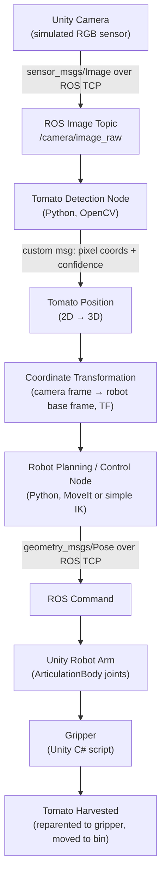
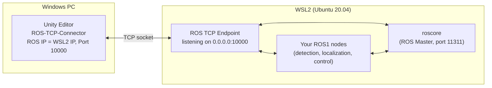

# Robotic Arm: Tomato Detection, Localization & Harvesting
### A ROS 1 + Unity (Windows) Simulation — Beginner-Friendly Build Guide

---

## Sources and Version Notes

This guide is built from the **official** Unity Robotics Hub repository and its sub-packages, verified directly against their current READMEs/tutorials (checked September 2026). Key sources:

- Unity Robotics Hub (main repo): https://github.com/Unity-Technologies/Unity-Robotics-Hub
- ROS–Unity integration setup doc (covers both ROS1 and ROS2, explicitly): `tutorials/ros_unity_integration/setup.md`
- Pick-and-Place tutorial (the ROS1 reference workflow this guide follows): `tutorials/pick_and_place/README.md`
- ROS TCP Connector package: https://github.com/Unity-Technologies/ROS-TCP-Connector
- ROS TCP Endpoint package: https://github.com/Unity-Technologies/ROS-TCP-Endpoint
- URDF Importer package: https://github.com/Unity-Technologies/URDF-Importer
- ROS 1 documentation: https://wiki.ros.org (Melodic / Noetic)
- MoveIt (ROS 1): https://moveit.ros.org

**Important, upfront, because it changes the whole architecture:**

- The Unity Robotics Hub repository **still fully supports ROS1**. The setup instructions are explicitly split with "ROS1" and "ROS2" markers throughout, and the ROS1 path (Melodic/Noetic, Catkin, `roslaunch ros_tcp_endpoint endpoint.launch`) is present and unchanged in the current `main` branch. ROS2 was **added on top of** the original ROS1 material, not as a replacement. This guide only uses the ROS1-marked paths.
- The flagship ROS1 example — the **Pick-and-Place tutorial** with the Niryo One arm and MoveIt — is explicitly noted by Unity as **tested with ROS Melodic (Python 2) and ROS Noetic (Python 3)**. It has not been re-validated by Unity against newer ROS distributions (ROS1 development has effectively stopped industry-wide; Noetic is the final ROS1 release and is supported by the ROS community until May 2025 EOL — after that date it receives no further official patches, though it continues to run fine on Ubuntu 20.04).
- The Unity-side packages (`ROS-TCP-Connector`, `URDF-Importer`) are older packages (last tagged releases around 2023) that have **not been updated for the newest Unity LTS releases**, but they are plain Unity Packages (UPM git packages), not deeply tied to engine internals, so they still work on recent Unity 2021–2022 LTS versions in practice. This guide tells you exactly where this matters.
- Unity officially documents **Docker** as the primary/recommended way to run the ROS1 side (a `melodic` Docker image is provided in the repo itself: `tutorials/ros_unity_integration/ros_docker/Dockerfile`). Running ROS1 inside **WSL2** is a very common and practical community setup, but it is **not an official Unity Robotics Hub-documented path** — the networking guidance for WSL2 in this guide is based on general WSL2 + Ubuntu + ROS1 networking practice, clearly labeled as such, not copied from an official Unity tutorial.

Everywhere below, statements are labeled:

- 🟦 **Official Unity Robotics Hub procedure** — taken directly from the verified repo/docs.
- 🟩 **Recommended adaptation for this project** — a specific choice made for *this* tomato-harvesting project, built on top of the official material.
- 🟧 **Modern workaround** — needed because the original ROS1 tutorial material is old, or because it doesn't cover WSL2/tomatoes/etc.

---

## 1. Project Overview

### What this project does
A simulated **RGB camera in Unity** looks at a small tomato-plant scene. A **ROS 1 node** analyzes each camera frame to find tomatoes ("detection"), a **second ROS 1 node** converts that 2D finding into a **3D position** relative to the robot ("localization"), and a **third ROS 1 node** drives a **simulated robotic arm's** gripper to that position, closes the gripper, and lifts the tomato into a collection bin ("harvesting"). Unity and ROS 1 are two separate programs, on possibly two separate machines/OSes, talking to each other over a **TCP socket connection**.

### What "detection" means
Finding *that* a tomato is present in an image and *where in the 2D image* (pixel coordinates / bounding box) it is. Detection does **not** tell you how far away the tomato is — only where it is on the flat picture.

### What "localization" means
Turning that 2D image position into a **3D point (X, Y, Z)** in a real-world coordinate frame — specifically, the tomato's position relative to the robot's base. This requires either depth information (a depth camera, stereo, or a simulation shortcut) plus a **coordinate transform** from camera frame → robot frame.

### What "harvesting" means
Using the 3D tomato position to (1) plan a path for the arm, (2) move the end-effector to the tomato, (3) close the gripper around it, (4) detach it from the plant, and (5) move it to a drop location.

### Overall system architecture



**Explaining every arrow:**

1. **Unity Camera → ROS Image Topic:** A Unity `Camera` renders to a texture each frame; a C# script converts that texture to a ROS `sensor_msgs/Image` message and publishes it over the TCP connection to the `/camera/image_raw` topic on the ROS side.
2. **ROS Image Topic → Detection Node:** A Python ROS node subscribes to `/camera/image_raw`, converts the ROS image message into an OpenCV image (`cv_bridge`), and searches for tomato-colored blobs.
3. **Detection → Tomato Position:** The detection node publishes a custom message containing the pixel center of each tomato found and a confidence score.
4. **Tomato Position → Coordinate Transformation:** The localization node converts the pixel position (plus a depth value — in the simulation shortcut, from Unity ground truth) into a 3D point in the camera's frame, then uses a static/dynamic transform to express it in the robot's base frame.
5. **Coordinate Transformation → Robot Planning/Control:** The 3D target pose (in the robot's base frame) is sent to the motion-planning/control node.
6. **Robot Planning/Control → ROS Command → Unity Robot Arm:** The control node computes a joint trajectory (via MoveIt or a simplified IK) and sends target joint angles/poses back across the TCP connection to Unity.
7. **Unity Robot Arm → Gripper → Tomato Harvested:** Unity's `ArticulationBody` joints move to the commanded angles; once the end-effector reaches the tomato, a C# gripper script closes the gripper, detaches the tomato from the plant object, parents it to the gripper, and finally releases it over the collection bin.

---

## 2. Final System Architecture

| Component | Runs where | Technology | Purpose |
|---|---|---|---|
| Unity simulation | Windows | Unity Editor / C# | Renders the 3D scene, physics, robot visualization |
| Robotic arm | Unity | URDF Importer → `ArticulationBody` | Simulated robot, driven by joint targets |
| Camera | Unity | Unity `Camera` component + C# publisher | Produces the RGB image ROS will process |
| Tomato objects | Unity | Simple C# / GameObjects | Detectable, harvestable fruit |
| ROS TCP Endpoint | ROS 1 machine (WSL2/Docker/Linux) | `ros_tcp_endpoint` (Python, ROS1 package) | The ROS-side half of the Unity↔ROS TCP link |
| ROS TCP Connector | Windows (inside Unity) | `com.unity.robotics.ros-tcp-connector` (C#) | The Unity-side half of the TCP link |
| Detection node | ROS 1 | Python + OpenCV | Finds tomatoes in the image (2D) |
| Localization node | ROS 1 | Python + `tf`/`tf2` | Computes 3D tomato position in robot frame |
| Robot controller node | ROS 1 | Python (+ MoveIt, optional) | Plans/executes arm motion to the target |
| Gripper logic | Unity (+ triggered by ROS) | C# | Simulated grasp/detach/carry/drop |
| ROS Master (`roscore`) | ROS 1 machine | ROS 1 core | Name service / topic registry for all ROS nodes |

This matches the requested table with one addition (Tomato objects, ROS Master) needed to make the system actually runnable.

---

## 3. Software and Hardware Requirements

### Minimum requirements
- **Windows 10** (64-bit) or Windows 11
- **Unity 2020.2 or later** — this is the Unity version explicitly stated as the minimum by the official ROS–Unity setup guide (`setup.md`: *"Launch Unity ... The Robotics package works best with a version of Unity no older than 2020"*; the `ROS-TCP-Connector` README states *"Using Unity 2020.2 or later"*).
- **8 GB RAM**, integrated GPU capable of running Unity's URP/Built-in renderer
- **WSL2 with Ubuntu 20.04**, OR a **Docker Desktop** installation on Windows (🟩 recommended adaptation — see Section 5), OR a separate Ubuntu machine/VM
- **ROS 1 Noetic** (Ubuntu 20.04) — 🟩 recommended over Melodic (Ubuntu 18.04) for a new project in 2026, because Melodic reached end-of-life in 2023 and Noetic is the only ROS1 distro still commonly installable on a supported Ubuntu LTS. (🟦 Unity's official pick_and_place tutorial itself notes it was tested on **both** Melodic/Python2 and Noetic/Python3 — so Noetic is an officially-validated choice, not a substitution.)
- **Python 3.8** (ships with Ubuntu 20.04 / ROS Noetic)
- **Git**

### Recommended requirements
- **Unity 2021.3 LTS** — a modern LTS release that the Robotics Hub packages are known to import into cleanly via UPM (🟧 modern workaround note: the official tutorial screenshots predate 2021.3, but the packages themselves are ordinary UPM git packages with no engine-version lock beyond "2020.2+", so 2021.3 LTS is a safe, well-supported target for a 2026 university project).
- **16 GB RAM**, dedicated GPU
- **Docker Desktop with WSL2 backend** — lets you use Unity's own pre-built `melodic`/ROS1 Dockerfile from the repo with the least networking pain (see Section 5)
- **VS Code** with the ROS and Python extensions, for editing both C# and Python code

### Unity packages (installed via Package Manager → "Add package from git URL")
- 🟦 `https://github.com/Unity-Technologies/ROS-TCP-Connector.git?path=/com.unity.robotics.ros-tcp-connector#v0.7.0`
- 🟦 `https://github.com/Unity-Technologies/URDF-Importer.git?path=/com.unity.robotics.urdf-importer#v0.5.2`

(Version tags shown are the latest tagged releases verified on the repos; omit the `#tag` to track the `main` branch instead, but a pinned tag is more reproducible for a class project.)

### ROS 1 packages (installed into your Catkin workspace)
- `ros_tcp_endpoint` (clone from https://github.com/Unity-Technologies/ROS-TCP-Endpoint, ROS1 default branch)
- `cv_bridge`, `image_transport` (from `ros-noetic-vision-opencv` / `ros-noetic-image-transport` apt packages)
- `tf`, `tf2_ros` (part of the standard `ros-noetic-desktop-full` install)
- `moveit` (`ros-noetic-moveit`, optional — only if you use MoveIt in Section 14)
- Your own custom packages: `tomato_detection`, `tomato_localization`, `tomato_harvesting`, `tomato_robot_control` (created in Section 7)

### Python packages (installed with `pip` inside the ROS1 Python 3 environment)
- `opencv-python`
- `numpy`
- `rospkg`, `catkin_pkg` (usually already present with a ROS install)

### Required Git repositories
- `https://github.com/Unity-Technologies/Unity-Robotics-Hub` (reference only — clone it to read/copy from, you are not building your whole project inside it)
- `https://github.com/Unity-Technologies/ROS-TCP-Connector`
- `https://github.com/Unity-Technologies/URDF-Importer`
- `https://github.com/Unity-Technologies/ROS-TCP-Endpoint`

### Optional hardware
None required — this is a pure simulation project. A real depth camera or a real robot arm are **out of scope** but are discussed as the "real-world equivalent" in Section 25.

---

## 4. Install ROS 1

🟩 **Recommended adaptation for this project:** ROS 1 Noetic on Ubuntu 20.04, running inside **WSL2** on the same Windows PC as Unity. This keeps everything on one machine (simplest for a student), while still being "a separate Ubuntu environment" as ROS1 requires.

### 4.1 Install WSL2 + Ubuntu 20.04

In **PowerShell (as Administrator)**:

```powershell
wsl --install -d Ubuntu-20.04
```

This installs the WSL2 subsystem and downloads Ubuntu 20.04. Reboot when prompted. On first launch of the Ubuntu app, you'll be asked to create a Linux username/password — this is separate from your Windows login.

Verify WSL2 (not WSL1) is being used:

```powershell
wsl -l -v
```

You should see `Ubuntu-20.04` with `VERSION 2`. If it shows `1`, upgrade it:

```powershell
wsl --set-version Ubuntu-20.04 2
```

### 4.2 Install ROS 1 Noetic inside Ubuntu

Open the Ubuntu terminal (search "Ubuntu 20.04" in the Windows start menu) and run, one block at a time:

```bash
# Add the ROS package repository to apt's source list
sudo sh -c 'echo "deb http://packages.ros.org/ros/ubuntu $(lsb_release -sc) main" > /etc/apt/sources.list.d/ros-latest.list'
```
This tells Ubuntu's package manager (`apt`) where to download ROS packages from.

```bash
# Add ROS's cryptographic signing key so apt trusts that repository
sudo apt install curl -y
curl -s https://raw.githubusercontent.com/ros/rosdistro/master/ros.asc | sudo apt-key add -
```

```bash
# Refresh the package lists and install the full ROS Noetic desktop
sudo apt update
sudo apt install ros-noetic-desktop-full -y
```
`ros-noetic-desktop-full` installs ROS core, common libraries (`tf`, `image_transport`, RViz, etc.) in one shot — this is what the official ROS1 documentation recommends for a general-purpose workstation install.

```bash
# Make every new terminal automatically load the ROS environment
echo "source /opt/ros/noetic/setup.bash" >> ~/.bashrc
source ~/.bashrc
```
`source /opt/ros/noetic/setup.bash` sets environment variables (`ROS_PACKAGE_PATH`, `PATH`, etc.) that let the shell find `roscore`, `rosrun`, `roslaunch`, and every installed ROS package. Adding it to `.bashrc` means you never have to type it manually again in new terminals.

```bash
# Install tools needed to build your own ROS packages
sudo apt install python3-rosdep python3-rosinstall python3-rosinstall-generator python3-wstool build-essential -y
sudo rosdep init
rosdep update
```
`rosdep` is ROS's dependency-resolution tool — it reads each package's `package.xml` and installs whatever system libraries it needs.

### 4.3 Create your Catkin workspace

```bash
mkdir -p ~/catkin_ws/src
cd ~/catkin_ws/
catkin_make
```
`catkin_make` is ROS1's build tool. Run with an empty `src/` folder, it just creates the `build/` and `devel/` folders and a top-level `CMakeLists.txt` symlink — this confirms your workspace is set up correctly before you add real packages.

```bash
echo "source ~/catkin_ws/devel/setup.bash" >> ~/.bashrc
source ~/.bashrc
```
This makes every new terminal aware of the packages you build inside `catkin_ws`, in addition to the system ROS packages.

### 4.4 Set networking environment variables

```bash
echo "export ROS_MASTER_URI=http://localhost:11311" >> ~/.bashrc
echo "export ROS_IP=$(hostname -I | awk '{print $1}')" >> ~/.bashrc
source ~/.bashrc
```
- **`ROS_MASTER_URI`** tells every ROS node *where the ROS Master (`roscore`) is running* (host + port 11311). Here everything — including `roscore` — runs on WSL2 itself, so `localhost` is correct.
- **`ROS_IP`** tells other machines (here: Windows/Unity) *what IP to send messages back to*. `hostname -I` prints WSL2's own IP address inside the Windows host, which changes on reboot — Section 5 shows how to always get the current value.

You now have a working ROS 1 environment. Do not open Unity yet — Section 5 covers the networking piece that lets it talk to this WSL2 instance.

---

## 5. Configure Windows + ROS Networking

🟧 This section is a **modern workaround**: it is not an official Unity Robotics Hub document (Unity's own instructions assume Docker or a plain Linux box on the same LAN, see Section 4/5 caveat above), but it reflects standard, well-documented WSL2 networking behavior.

### 5.1 How the connection actually works

Unity does **not** talk to `roscore` directly. It talks to a small ROS1 node called the **ROS TCP Endpoint**, which acts as a bridge:

```
Unity (Windows, ROS-TCP-Connector) <--TCP socket, default port 10000--> ROS TCP Endpoint (ROS1 node, WSL2) <--normal ROS topics--> rest of your ROS graph
```

So there are two IP addresses that matter:

- **The WSL2 machine's IP** — this is where the ROS TCP Endpoint listens. Unity needs to know this IP to connect *out* to ROS.
- **The Windows machine's IP (as seen from WSL2)** — only matters if a ROS node needs to reach *back into* Windows unprompted; for this project's architecture, Unity always initiates the connection, so this is rarely needed.

### 5.2 WSL2 networking mode matters

WSL2 (on Windows 10, and Windows 11 before the "mirrored" networking mode) runs Ubuntu behind a lightweight virtual NAT network — WSL2 gets its own private IP address, different from your Windows PC's LAN IP, and that IP **changes every time you reboot WSL2**. This is the single most common source of "Unity can't connect to ROS" problems for this kind of project.

Two practical options:

**Option A — Windows 11 with "mirrored" WSL networking (simplest, if available)**

If you're on a recent Windows 11 build, add this to `%UserProfile%\.wslconfig` (create the file if it doesn't exist):

```ini
[wsl2]
networkingMode=mirrored
```

Then in PowerShell: `wsl --shutdown`, then relaunch Ubuntu. In mirrored mode, WSL2 shares Windows' own network interface and IP address — so `localhost` works both ways, and you can skip most of the IP-juggling below. Unity's ROS IP Address setting would simply be `127.0.0.1`.

**Option B — NAT mode (default on Windows 10 and older Windows 11 builds)**

You must find WSL2's current IP each session and enter it into Unity:

```bash
# Run inside WSL2/Ubuntu
hostname -I
```
This prints WSL2's current private IP, e.g. `172.28.64.1`. This is the address you'll type into Unity's ROS Settings (Section 6).

### 5.3 Windows Firewall

WSL2's NAT still routes through the Windows network stack, so **Windows Defender Firewall** can block the incoming connection from Unity to the ROS TCP Endpoint's port (default **10000**). Allow it:

```powershell
# Run in PowerShell as Administrator
New-NetFirewallRule -DisplayName "WSL2 ROS TCP Endpoint" -Direction Inbound -LocalPort 10000 -Protocol TCP -Action Allow
```

### 5.4 Start the ROS TCP Endpoint and note its address

Inside WSL2/Ubuntu, once you've built the `ros_tcp_endpoint` package (Section 7):

```bash
roscore &
roslaunch ros_tcp_endpoint endpoint.launch tcp_ip:=0.0.0.0 tcp_port:=10000
```
This is 🟦 the official launch command pattern from `setup.md`, with `tcp_ip:=0.0.0.0` (listen on all interfaces, so it accepts the incoming connection regardless of exactly which WSL2 interface Windows routes through) and the default port `10000`.

You should see it print something like:
```
[INFO] ... Starting server on 0.0.0.0:10000
```

### 5.5 Test connectivity from Windows

In PowerShell (with the endpoint running):

```powershell
Test-NetConnection -ComputerName <WSL2_IP_from_hostname_-I> -Port 10000
```
`TcpTestSucceeded : True` means Windows can reach the port. If it fails: re-check the firewall rule (5.3), re-check the WSL2 IP hasn't changed since you last checked (5.2), and confirm the endpoint is actually running (5.4).

### 5.6 Simple network diagram



### 5.7 Alternatives to WSL2, and which to pick

| Option | Pros | Cons | Verdict |
|---|---|---|---|
| **WSL2 + Ubuntu** | One machine, fast, free, good for iterative dev | IP changes on reboot (NAT mode), some driver/GUI quirks for RViz | 🟩 **Recommended for this project** — best balance for a solo student on a single laptop |
| **Docker (Unity's own `melodic` image)** | 🟦 Officially provided by Unity Robotics Hub; fully reproducible; identical environment every time | Ubuntu 18.04/Melodic base image is older; still needs Windows↔container networking (same class of IP issues as WSL2, arguably simpler since Docker Desktop publishes ports cleanly with `-p 10000:10000`) | 🟩 Good alternative, especially if you want to match Unity's tutorial exactly |
| **Separate Ubuntu computer** | Real network, simplest conceptually (two real IPs on the same LAN/router), no virtualization quirks | Requires a second physical machine | Best if available, otherwise not practical for most students |
| **Virtual machine (VirtualBox/VMware) running Ubuntu** | Full Ubuntu desktop, very close to native ROS dev experience, RViz "just works" | Slower than WSL2, more RAM/disk needed, VM networking (bridged vs NAT) has the same IP-discovery issue as WSL2 | Solid fallback if WSL2 gives driver trouble |

**Recommendation for a university project:** start with **WSL2 + Ubuntu 20.04 + ROS Noetic**, using mirrored networking if your Windows 11 build supports it (Section 5.2, Option A) — this removes almost all of the IP-address pain. If mirrored mode isn't available, use NAT mode and just get in the habit of running `hostname -I` each session.

---

## 6. Install Unity

### 6.1 Unity Hub and Editor version

🟦 Per the official setup guide, the Robotics packages require **Unity 2020.2 or later**. 🟩 For this project, install **Unity 2021.3 LTS** via Unity Hub — it's a long-term-support release, still receives security patches, and is well past the packages' minimum version without being so new that UPM git-package resolution or ArticulationBody behavior has drifted meaningfully from what the tutorials show.

1. Download Unity Hub: https://unity.com/download
2. In Unity Hub → **Installs** → **Install Editor** → select **2021.3 LTS** (or the latest 2021.3.x patch)
3. During component selection, make sure **Windows Build Support** is checked (default on Windows)

### 6.2 Create the project

1. Unity Hub → **Projects** → **New Project**
2. Template: **3D (Built-in Render Pipeline)** — simplest for this project; URP also works but Built-in avoids extra shader-conversion steps for imported URDF materials
3. Name it e.g. `TomatoHarvestingRobot`, choose a location on your Windows disk (not inside a WSL2 path)

### 6.3 Install the ROS TCP Connector package

1. In Unity: **Window → Package Manager**
2. Click **+** (top-left) → **Add package from git URL...**
3. Paste:
   ```
   https://github.com/Unity-Technologies/ROS-TCP-Connector.git?path=/com.unity.robotics.ros-tcp-connector
   ```
4. Click **Add**. Unity downloads and imports the package (this can take a minute).

This is 🟦 the exact official installation step from both the `ROS-TCP-Connector` README and `setup.md`.

### 6.4 Install the URDF Importer package

Same Package Manager **+** → **Add package from git URL...**:
```
https://github.com/Unity-Technologies/URDF-Importer.git?path=/com.unity.robotics.urdf-importer
```

🟦 Official install method, taken from the `URDF-Importer` README.

### 6.5 Set the ROS IP in Unity

1. Unity menu bar → **Robotics → ROS Settings**
2. Set **Protocol** to **ROS1** (this dropdown exists because the same package also supports ROS2 — make sure it says ROS1, not ROS2)
3. Set **ROS IP Address** to your WSL2 IP from Section 5 (or `127.0.0.1` if using mirrored networking)
4. Leave **ROS Port** at `10000` (matches the endpoint's default)

🟦 This exact menu path (`Robotics → ROS Settings`) and the `ROS IP Address` field are documented in `setup.md`.

---

## 7. Create the ROS Workspace

Inside WSL2/Ubuntu:

```
~/catkin_ws/
├── src/
│   ├── ros_tcp_endpoint/          # cloned from Unity-Technologies/ROS-TCP-Endpoint (ROS1 branch)
│   ├── tomato_msgs/                # our custom .msg definitions
│   ├── tomato_detection/           # 2D tomato detection node
│   ├── tomato_localization/        # 2D→3D position + TF
│   ├── tomato_robot_control/       # arm motion + gripper trigger node
│   └── tomato_harvesting_bringup/  # launch files that start everything together
├── build/     (auto-generated by catkin_make)
└── devel/     (auto-generated by catkin_make)
```

Clone the endpoint package:

```bash
cd ~/catkin_ws/src
git clone https://github.com/Unity-Technologies/ROS-TCP-Endpoint.git ros_tcp_endpoint
cd ~/catkin_ws
catkin_make
source devel/setup.bash
```

**What each package does:**
- `ros_tcp_endpoint` — 🟦 official Unity package; the ROS1 node that bridges TCP messages from Unity into normal ROS topics/services, and back.
- `tomato_msgs` — holds our custom `.msg` files (Section 13) shared by every other package.
- `tomato_detection` — subscribes to the camera image topic, publishes detected tomato pixel positions.
- `tomato_localization` — subscribes to detections, publishes 3D tomato poses in the robot base frame.
- `tomato_robot_control` — subscribes to 3D tomato poses, drives the arm and gripper.
- `tomato_harvesting_bringup` — contains the top-level `.launch` file that starts all of the above with one command.

We'll fill in the contents of each package in Sections 11–19.

---

## 8. Import the Robotic Arm into Unity

### 8.1 What URDF is
**URDF (Unified Robot Description Format)** is an XML format used throughout ROS to describe a robot: its **links** (rigid bodies — like "forearm", "gripper finger"), its **joints** (how links connect and move relative to each other — revolute, prismatic, fixed), visual meshes, collision meshes, and physical properties (mass, inertia). Unity's URDF Importer package reads this XML and builds a matching Unity GameObject hierarchy.

### 8.2 Choosing a robot model
🟩 **Recommended adaptation:** use the **Niryo One** arm — the same 6-DOF robot used in Unity's own official Pick-and-Place tutorial. Its URDF is provided directly inside the Unity Robotics Hub repository (`tutorials/pick_and_place/Assets/URDF/niryo_one/`), it's a small desktop arm well-suited to picking small objects like a tomato, and reusing Unity's own verified URDF avoids the biggest source of URDF-import problems (malformed meshes/joints) for a first project.

Clone the Hub repo to get the URDF files and reference project:
```bash
git clone --recurse-submodules https://github.com/Unity-Technologies/Unity-Robotics-Hub.git
```
Then copy the `niryo_one` URDF folder from `Unity-Robotics-Hub/tutorials/pick_and_place/Assets/URDF/` into your own project's `Assets/URDF/` folder.

### 8.3 Importing the URDF
1. In Unity's **Project** window, locate the copied `niryo_one.urdf` file
2. Right-click it → **Import Robot from Selected URDF file**
3. In the import dialog:
   - **Axis type**: choose **Y Axis** (Unity is Y-up; most ROS URDFs are authored Z-up — the importer handles the conversion, this setting tells it the source convention, which for the Niryo One URDF is Y-up as shipped by Unity's own converted files)
   - **Mesh Decomposer**: leave default (VHACD) — this generates simplified convex collision meshes from the visual meshes
4. Click **Import URDF**

🟦 This exact workflow (right-click → Import Robot from Selected URDF file, with the two settings above) is documented in the URDF Importer README and the pick_and_place Part 1 tutorial.

### 8.4 Joint configuration, ArticulationBody, and physics
The importer creates each link as a Unity GameObject with an **`ArticulationBody`** component (not a regular `Rigidbody` — Unity's articulation system is purpose-built for kinematic chains like robot arms, and is what both the official tutorial and MoveIt-integration examples rely on). For each joint:
- **Joint Type** (Revolute/Prismatic/Fixed) is set to match the URDF
- **Joint limits** (min/max angle or travel) are copied from the URDF's `<limit>` tags
- Select each link and check the **Articulation Body** component in the Inspector to see/tune: **Drive** stiffness/damping/force limit (these control how "stiff" the simulated motor is when tracking a target angle — too low and the arm sags under gravity; too high and it can overshoot/oscillate)

### 8.5 Colliders
The URDF's `<collision>` meshes become **Mesh Colliders** (often simplified via VHACD convex decomposition, since Unity's physics engine handles convex colliders far more efficiently and reliably than concave ones). Keep collision meshes separate from the (often more detailed) visual meshes — this is standard URDF practice and is what the importer expects.

### 8.6 Coordinate systems (critical, and a common source of bugs)
- **ROS convention:** X-forward, Y-left, Z-up (right-handed)
- **Unity convention:** X-right, Y-up, Z-forward (left-handed)

The ROS-TCP-Connector's message-conversion extension methods (e.g. `msg.From<FLU>()` / `.To<FLU>()`) handle this conversion automatically **when you use them** to convert between `geometry_msgs/Point`/`Pose` and Unity `Vector3`/`Quaternion` — you must not manually swap axes yourself, or you'll double-convert. This is used directly in the code in Section 13/19.

### 8.7 End-effector and gripper
The Niryo One URDF includes a simple two-finger gripper as the last links in the chain. We'll drive it with a small C# script (Section 16) that moves the two finger `ArticulationBody`s together/apart rather than trying to model a full URDF-driven grasp — this is called out explicitly as a simplification in Section 16.

---

## 9. Build the Tomato Farm Environment

Keep this deliberately simple — the point of the project is the detection→localization→control pipeline, not environment art.

1. **Ground**: `GameObject → 3D Object → Plane`, scale to roughly a 2×2 m tabletop, apply a soil/table-colored Material.
2. **Tomato plants**: a few simple green `Cylinder` (stem) + `Sphere` (foliage clumps) GameObjects grouped under an empty `TomatoPlant` parent. No need for a realistic plant asset for the first version.
3. **Tomato fruits**: small red `Sphere` GameObjects (scale ~0.05 in each axis), tagged with a custom Tag `"Tomato"` so the harvesting logic can find them, positioned at the ends of "branches" (empty child transforms on the plant) within the arm's reach.
4. **Robotic arm**: your imported Niryo One prefab (Section 8), placed at the workspace origin.
5. **Camera**: a `Camera` GameObject positioned above/in-front of the plants, angled down slightly, covering the tomato area (Section 10).
6. **Lighting**: one `Directional Light`, flat and even — since Section 11's Stage 1 detection uses plain HSV color segmentation, avoid harsh shadows or strong colored lighting, which would shift the tomatoes' apparent hue.

### Generating multiple tomatoes
Write a small editor-only helper script that instantiates a `Tomato` prefab at randomized positions along each plant's "branch" transforms:

```csharp
// Assets/Scripts/Environment/TomatoSpawner.cs
using UnityEngine;

public class TomatoSpawner : MonoBehaviour
{
    public GameObject tomatoPrefab;
    public Transform[] branchPoints;
    [Range(0f, 0.03f)] public float jitter = 0.02f;

    void Start()
    {
        foreach (var branch in branchPoints)
        {
            Vector3 offset = new Vector3(
                Random.Range(-jitter, jitter),
                Random.Range(-jitter, jitter),
                Random.Range(-jitter, jitter));
            GameObject tomato = Instantiate(tomatoPrefab, branch.position + offset, Quaternion.identity, branch);
            tomato.tag = "Tomato";
        }
    }
}
```
Attach this to an empty `TomatoSpawnerManager` GameObject, assign a red-sphere `tomatoPrefab`, and populate `branchPoints` with the empty child transforms placed around your plant models.

---

## 10. Camera Setup

### 10.1 Placement, orientation, field of view
- Position the camera ~0.4–0.6 m above and in front of the plant row, tilted ~30–45° downward, so the visible tomatoes are roughly centered in frame and not too small.
- **Field of View**: 60° is a reasonable starting point (Unity `Camera.fieldOfView`) — wide enough to see multiple tomatoes, narrow enough that they aren't tiny.
- **Resolution**: capture at a modest size — **640×480** — so image transfer over the TCP link and OpenCV processing both stay fast in real time.

### 10.2 Coordinate systems for the camera
Unity cameras look down their local **+Z** axis. When you later use the camera's known position/rotation for the "Unity ground-truth localization" shortcut (Section 12), you're working entirely in Unity's left-handed, Y-up coordinate system; the conversion to ROS's right-handed, Z-up convention happens only when a message actually crosses the TCP connection (Section 8.6).

### 10.3 Publishing camera images to ROS
This uses the `RosConnection` and `RGBImageMsg`-style publishing from `ROS-TCP-Connector`, which supports encoding a Unity render as a ROS `sensor_msgs/Image`.

```csharp
// Assets/Scripts/ROS/RosImagePublisher.cs
using UnityEngine;
using Unity.Robotics.ROSTCPConnector;
using RosMessageTypes.Sensor;
using RosMessageTypes.Std;
using System;

public class RosImagePublisher : MonoBehaviour
{
    ROSConnection ros;
    public string topicName = "/camera/image_raw";
    public Camera sourceCamera;
    public int imageWidth = 640;
    public int imageHeight = 480;
    public float publishRateHz = 5f; // keep modest for a student laptop

    RenderTexture renderTexture;
    Texture2D readbackTexture;
    float timeSinceLastPublish;

    void Start()
    {
        ros = ROSConnection.GetOrCreateInstance();
        ros.RegisterPublisher<ImageMsg>(topicName);

        renderTexture = new RenderTexture(imageWidth, imageHeight, 24);
        sourceCamera.targetTexture = renderTexture;
        readbackTexture = new Texture2D(imageWidth, imageHeight, TextureFormat.RGB24, false);
    }

    void Update()
    {
        timeSinceLastPublish += Time.deltaTime;
        if (timeSinceLastPublish < 1f / publishRateHz) return;
        timeSinceLastPublish = 0f;
        PublishImage();
    }

    void PublishImage()
    {
        RenderTexture.active = renderTexture;
        readbackTexture.ReadPixels(new Rect(0, 0, imageWidth, imageHeight), 0, 0);
        readbackTexture.Apply();
        RenderTexture.active = null;

        byte[] rawData = readbackTexture.GetRawTextureData();

        ImageMsg msg = new ImageMsg
        {
            header = new HeaderMsg { frame_id = "camera_link" },
            height = (uint)imageHeight,
            width = (uint)imageWidth,
            encoding = "rgb8",
            is_bigendian = 0,
            step = (uint)(imageWidth * 3),
            data = rawData
        };
        ros.Publish(topicName, msg);
    }
}
```
Attach this script to your Camera GameObject, assign `sourceCamera` (itself), and set `topicName` to `/camera/image_raw`.

### 10.4 The ROS image topic
🟧 **Verify-before-use note, as requested:** `/camera/image_raw` is a conventional ROS topic name (matches the standard `image_transport`/`camera_info` naming convention used throughout ROS1, e.g. by `usb_cam` and similar driver packages) — it is **not a name hard-coded or required by Unity Robotics Hub**; you are choosing it yourself, and both the Unity publisher script above and the Python subscriber in Section 11 must simply agree on it. The message type, `sensor_msgs/Image`, **is** the real, standard ROS1 message type for raw images (`std_msgs/Header header; uint32 height; uint32 width; string encoding; uint8 is_bigendian; uint32 step; uint8[] data`), and `RosMessageTypes.Sensor.ImageMsg` is the auto-generated Unity C# equivalent that ships as part of `ROS-TCP-Connector`'s built-in common message set.

---

## 11. Tomato Detection

All detection code runs as a **Python 3 ROS1 node** inside your `tomato_detection` package.

### Stage 1 — Simple detection (HSV color segmentation)

```python
#!/usr/bin/env python3
# ~/catkin_ws/src/tomato_detection/scripts/tomato_detector.py
import rospy
import cv2
import numpy as np
from cv_bridge import CvBridge
from sensor_msgs.msg import Image
from tomato_msgs.msg import TomatoDetection, TomatoDetectionArray

class TomatoDetector:
    def __init__(self):
        self.bridge = CvBridge()
        self.pub = rospy.Publisher('/tomato/detections', TomatoDetectionArray, queue_size=1)
        self.sub = rospy.Subscriber('/camera/image_raw', Image, self.image_callback, queue_size=1)

        # Red HSV ranges (red wraps around 0/180 in OpenCV's HSV hue space)
        self.lower_red1 = np.array([0, 100, 80])
        self.upper_red1 = np.array([10, 255, 255])
        self.lower_red2 = np.array([170, 100, 80])
        self.upper_red2 = np.array([180, 255, 255])
        self.min_area = 40  # pixels, filters out noise

    def image_callback(self, msg):
        cv_image = self.bridge.imgmsg_to_cv2(msg, desired_encoding='rgb8')
        hsv = cv2.cvtColor(cv_image, cv2.COLOR_RGB2HSV)

        mask1 = cv2.inRange(hsv, self.lower_red1, self.upper_red1)
        mask2 = cv2.inRange(hsv, self.lower_red2, self.upper_red2)
        mask = cv2.bitwise_or(mask1, mask2)
        mask = cv2.morphologyEx(mask, cv2.MORPH_OPEN, np.ones((3, 3), np.uint8))  # Stage 2: remove speckle noise

        contours, _ = cv2.findContours(mask, cv2.RETR_EXTERNAL, cv2.CHAIN_APPROX_SIMPLE)

        detections = TomatoDetectionArray()
        detections.header = msg.header
        for i, c in enumerate(contours):
            area = cv2.contourArea(c)
            if area < self.min_area:
                continue
            M = cv2.moments(c)
            if M['m00'] == 0:
                continue
            cx = int(M['m10'] / M['m00'])
            cy = int(M['m01'] / M['m00'])
            (_, _), radius = cv2.minEnclosingCircle(c)  # Stage 2: circularity as a confidence proxy
            circularity = area / (np.pi * radius * radius) if radius > 0 else 0

            det = TomatoDetection()
            det.tomato_id = i
            det.confidence = float(np.clip(circularity, 0.0, 1.0))
            det.pixel_x = cx
            det.pixel_y = cy
            detections.detections.append(det)

        self.pub.publish(detections)

if __name__ == '__main__':
    rospy.init_node('tomato_detector')
    TomatoDetector()
    rospy.spin()
```

Make it executable: `chmod +x ~/catkin_ws/src/tomato_detection/scripts/tomato_detector.py`

**Explanation:**
- **Input image**: `sensor_msgs/Image` on `/camera/image_raw`
- **Detection**: HSV threshold for red, contour extraction
- **Bounding box / center**: contour centroid (`cx, cy`) via image moments
- **Confidence**: contour circularity (how close the blob's shape is to a perfect circle — a reasonable free proxy for "looks like a round tomato" with zero training data)
- **Output ROS message**: custom `TomatoDetectionArray` (Section 13)

### Stage 3 — Optional AI detection
If the student wants to go further, Stage 1/2's OpenCV pipeline can be swapped for a **YOLOv5/v8** model run via `ultralytics` in the same node structure (subscribe to the image, run `model(cv_image)`, publish the same `TomatoDetectionArray` message from the bounding boxes) — this is optional and not required for the core project to work.

---

## 12. Tomato Localization

### 2D detection vs. 3D localization
Section 11 only gives a **pixel location** (`cx, cy`) — a 2D point on a flat image with no notion of distance. **Localization** must add depth to produce a full 3D point `(X, Y, Z)`.

### Approaches, compared

| Approach | How it works | Simulation-appropriate? |
|---|---|---|
| 1. Known tomato depth | Assume tomatoes are always at a fixed known distance from camera | Only works if all tomatoes are at exactly the same distance — too limiting |
| 2. RGB-D camera | A depth sensor (like a simulated Kinect) gives per-pixel depth directly | Realistic but adds setup complexity (needs a Unity depth-camera shader/pass) |
| 3. Stereo camera | Two cameras, triangulate depth from disparity | Most realistic to a real deployment, most complex to implement well |
| 4. Ray casting / Unity ground-truth localization | Use Unity's own `Physics.Raycast` from the camera through the detected pixel to find the exact 3D point of the tomato object it hits | 🟩 **Simplest and most reliable for a first working simulation** |
| 5. Camera projection + known geometry | Use camera intrinsics + an assumed real-world tomato diameter to back out distance from the bounding box's pixel size | A decent "semi-realistic" middle ground if raycasting feels too much like cheating |

### 🟩 Recommended: Unity ground-truth localization (a labeled simulation shortcut)

Instead of adding a second ROS message hop, do the raycast **in Unity**, then publish the resulting 3D point directly — this keeps the pipeline simple while still exercising the full detect→localize→control→harvest loop.

```csharp
// Assets/Scripts/ROS/RosTomatoLocalizer.cs
using UnityEngine;
using Unity.Robotics.ROSTCPConnector;
using Unity.Robotics.ROSTCPConnector.ROSGeometry;
using RosMessageTypes.Geometry;
using RosMessageTypes.Tomato; // matches the tomato_msgs package generated messages

public class RosTomatoLocalizer : MonoBehaviour
{
    public Camera sourceCamera;
    ROSConnection ros;
    public string subTopic = "/tomato/detections";
    public string pubTopic = "/tomato/positions_3d";

    void Start()
    {
        ros = ROSConnection.GetOrCreateInstance();
        ros.RegisterPublisher<TomatoPosition3DArrayMsg>(pubTopic);
        ros.Subscribe<TomatoDetectionArrayMsg>(subTopic, OnDetections);
    }

    void OnDetections(TomatoDetectionArrayMsg msg)
    {
        var outMsg = new TomatoPosition3DArrayMsg();
        foreach (var det in msg.detections)
        {
            // Convert the pixel coords published by the ROS detector back to a Unity screen-space ray.
            // NOTE: sourceCamera.pixelWidth/pixelHeight must match the resolution used when publishing in Section 10.
            Vector3 screenPoint = new Vector3(det.pixel_x, sourceCamera.pixelHeight - det.pixel_y, 0);
            Ray ray = sourceCamera.ScreenPointToRay(screenPoint);

            if (Physics.Raycast(ray, out RaycastHit hit, 5f) && hit.collider.CompareTag("Tomato"))
            {
                // SIMULATION SHORTCUT: this is Unity ground truth, not a real depth measurement.
                var posUnity = hit.point;

                var posRos = new TomatoPosition3DMsg
                {
                    tomato_id = det.tomato_id,
                    confidence = det.confidence,
                    position = posUnity.To<FLU>() // Unity -> ROS (FLU = Forward-Left-Up) axis conversion
                };
                outMsg.positions.Add(posRos);
            }
        }
        ros.Publish(pubTopic, outMsg);
    }
}
```

**How a real camera system would differ:** a real deployment would replace the `Physics.Raycast` call with an actual depth reading from an RGB-D or stereo sensor (options 2/3 above), and would also need real camera-to-robot **extrinsic calibration** (measuring exactly where the physical camera sits relative to the physical robot base — in Unity, this is exact by construction because everything is placed in the same scene graph).

### Coordinate transformations
```
Camera frame  →  Unity world frame  →  ROS world frame (via .To<FLU>())  →  Robot base frame (via TF)  →  End-effector frame (via arm's forward kinematics)
```
- **Camera → Unity world**: `Physics.Raycast` already returns a Unity **world-space** point (`hit.point`), so this first step is implicit in the code above.
- **Unity world → ROS**: the `.To<FLU>()` extension method from `Unity.Robotics.ROSTCPConnector.ROSGeometry` performs the axis-convention conversion described in Section 8.6.
- **ROS world → Robot base frame**: if your ROS "world" frame and robot base frame coincide (a reasonable simplification when the robot base is placed at the Unity scene origin), this step is the identity transform; otherwise, publish a **static TF transform** (`tf2_ros.StaticTransformBroadcaster`) once at startup describing the fixed offset between them, and use `tf2_ros.Buffer().transform()` to convert the point.
- **Robot base → end-effector frame**: this is computed by the robot controller's inverse kinematics (Section 14/15), not needed at the localization stage.

### Is `tf`/`tf2` appropriate here?
🟩 Yes, but minimally: use it for the one static transform above (if camera/world/base frames don't coincide), not for a full dynamic TF tree. A full TF tree (with every link publishing its own live transform) is standard ROS practice and valuable to learn, but it's more setup than this project strictly needs, since Unity's `ArticulationBody` chain already gives you exact link poses locally.

---

## 13. ROS Messages

Custom messages live in `~/catkin_ws/src/tomato_msgs/msg/`.

**`TomatoDetection.msg`** (2D detection, one tomato):
```
int32 tomato_id
float32 confidence
int32 pixel_x
int32 pixel_y
```

**`TomatoDetectionArray.msg`** (all detections in one frame):
```
std_msgs/Header header
TomatoDetection[] detections
```

**`TomatoPosition3D.msg`** (localized 3D tomato):
```
int32 tomato_id
float32 confidence
geometry_msgs/Point position
```

**`TomatoPosition3DArray.msg`**:
```
TomatoPosition3D[] positions
```

**`tomato_msgs/package.xml`** and **`CMakeLists.txt`** must declare the message dependencies — the key lines in `CMakeLists.txt`:
```cmake
find_package(catkin REQUIRED COMPONENTS message_generation std_msgs geometry_msgs)
add_message_files(FILES TomatoDetection.msg TomatoDetectionArray.msg TomatoPosition3D.msg TomatoPosition3DArray.msg)
generate_messages(DEPENDENCIES std_msgs geometry_msgs)
catkin_package(CATKIN_DEPENDS message_runtime std_msgs geometry_msgs)
```
and in `package.xml`:
```xml
<build_depend>message_generation</build_depend>
<exec_depend>message_runtime</exec_depend>
<depend>std_msgs</depend>
<depend>geometry_msgs</depend>
```

After adding these files: `cd ~/catkin_ws && catkin_make && source devel/setup.bash`

### Which standard ROS message types are actually needed
- **`sensor_msgs/Image`** — yes, for the raw camera feed (Section 10)
- **`geometry_msgs/Point`** — yes, embedded inside `TomatoPosition3D` for the 3D tomato location
- **`geometry_msgs/Pose`** — yes, for commanding the arm's target end-effector pose (Section 14) — a `Pose` is a `Point` + `Quaternion` orientation, needed because the gripper's approach *angle* matters, not just its position
- **`geometry_msgs/PoseStamped`** — yes, if you publish/consume any pose through `tf2` (it adds a `Header` with frame + timestamp, which `tf2` requires) — used for the one static transform in Section 12, and optionally for MoveIt goal poses in Section 14
- **`tf` / `tf2`** — only the lightweight static-transform usage described in Section 12; not a full dynamic TF tree

### Generating the matching Unity C# message classes
In Unity: **Robotics → Generate ROS Messages...** → Browse to `~/catkin_ws/src/tomato_msgs/msg` (from Windows, this is visible under `\\wsl$\Ubuntu-20.04\home\<you>\catkin_ws\src\tomato_msgs\msg`) → select the folder → **Build 4 msgs**. This generates the `RosMessageTypes.Tomato.*Msg` C# classes referenced in Sections 10–12 and 19.

🟦 This exact **Robotics → Generate ROS Messages...** workflow is the official message-generation step documented in `setup.md`.

---

## 14. Robot Motion

### Simple implementation sequence
1. Receive tomato 3D position (`/tomato/positions_3d`)
2. Move robot toward a predefined **approach pose** (a fixed pose a short distance above/in front of the target, to avoid crashing straight into the plant)
3. Move toward the tomato (final approach)
4. Close gripper
5. Lift tomato (move straight up a fixed distance)
6. Move to a fixed harvesting/drop-off pose (above the collection bin)
7. Release tomato (open gripper)

### Direct joint commands vs. IK vs. MoveIt vs. custom IK

| Method | What it is | Verdict for this project |
|---|---|---|
| Direct joint commands | You compute/hand-pick joint angles yourself for each pose | Only practical for a robot with very few DOF or pre-recorded poses; brittle for arbitrary tomato positions |
| Custom IK | Write your own inverse-kinematics solver (analytical or iterative/Jacobian-based) for the specific 6-DOF arm | Educational, but a real time investment; reasonable as a stretch goal |
| **MoveIt** | 🟦 ROS1's standard motion-planning framework; given a target end-effector pose, computes a full collision-aware joint trajectory | 🟩 **Recommended** — this is exactly what Unity's own official Pick-and-Place tutorial uses with the Niryo One, so it's the best-supported, most-documented path for this specific robot/workflow |
| Inverse Kinematics via `moveit_commander`'s simple pose targets | MoveIt used just for IK (not full planning) | A lighter-weight alternative to full MoveIt planning if performance is a concern |

### MoveIt + ROS1 compatibility and installation
MoveIt for ROS1 Noetic is a standard apt package:
```bash
sudo apt install ros-noetic-moveit -y
```
🟩 Recommended: reuse Unity's own **`niryo_moveit`** MoveIt configuration package, already provided inside the Hub repo at `tutorials/pick_and_place/ROS/src/niryo_moveit/` (config, SRDF, kinematics.yaml, launch files) — since it's built specifically for the exact URDF you imported in Section 8, it avoids re-deriving joint limits/kinematics plugin settings by hand. Copy that folder into `~/catkin_ws/src/`, then:
```bash
cd ~/catkin_ws && catkin_make && source devel/setup.bash
```

### Robot controller node (calls MoveIt, triggers the gripper)
```python
#!/usr/bin/env python3
# ~/catkin_ws/src/tomato_robot_control/scripts/robot_controller.py
import rospy
import moveit_commander
import geometry_msgs.msg
from tomato_msgs.msg import TomatoPosition3DArray
from std_msgs.msg import Bool

class RobotController:
    def __init__(self):
        moveit_commander.roscpp_initialize([])
        self.group = moveit_commander.MoveGroupCommander("arm")  # group name from niryo_moveit's SRDF
        self.gripper_pub = rospy.Publisher('/tomato/gripper_command', Bool, queue_size=1)
        rospy.Subscriber('/tomato/positions_3d', TomatoPosition3DArray, self.on_tomato)
        self.approach_offset = 0.08  # meters above the tomato, for the approach pose
        self.busy = False

    def on_tomato(self, msg):
        if self.busy or not msg.positions:
            return
        self.busy = True
        target = msg.positions[0]  # harvest the first detected tomato this cycle

        approach = geometry_msgs.msg.Pose()
        approach.position.x = target.position.x
        approach.position.y = target.position.y
        approach.position.z = target.position.z + self.approach_offset
        approach.orientation.w = 1.0  # gripper pointing straight down; refine per your gripper's zero-orientation

        self.group.set_pose_target(approach)
        self.group.go(wait=True)

        final = geometry_msgs.msg.Pose()
        final.position.x = target.position.x
        final.position.y = target.position.y
        final.position.z = target.position.z
        final.orientation.w = 1.0
        self.group.set_pose_target(final)
        self.group.go(wait=True)

        self.gripper_pub.publish(Bool(data=True))  # close gripper
        rospy.sleep(0.5)

        lift = geometry_msgs.msg.Pose()
        lift.position.x = target.position.x
        lift.position.y = target.position.y
        lift.position.z = target.position.z + 0.15
        lift.orientation.w = 1.0
        self.group.set_pose_target(lift)
        self.group.go(wait=True)

        drop = geometry_msgs.msg.Pose()
        drop.position.x, drop.position.y, drop.position.z = 0.0, -0.3, 0.25  # fixed bin location
        drop.orientation.w = 1.0
        self.group.set_pose_target(drop)
        self.group.go(wait=True)

        self.gripper_pub.publish(Bool(data=False))  # open gripper
        rospy.sleep(0.5)
        self.busy = False

if __name__ == '__main__':
    rospy.init_node('tomato_robot_controller')
    RobotController()
    rospy.spin()
```

Unity's `ArticulationBody` joints then need a subscriber that takes MoveIt's resulting trajectory/joint states and applies them — the official pick_and_place tutorial's `Controller.cs` pattern (subscribing to a joint trajectory service response and driving `ArticulationBody.xDrive.target` per joint) is the reference implementation for this piece; adapt it directly rather than reinventing it, since it is already solved and tested for the Niryo One in that tutorial.

---

## 14A. Static and Dynamic Obstacle Avoidance

### First, a terminology correction worth making explicit
Nothing in this project's architecture uses machine learning for motion — MoveIt's planners (OMPL/KDL) are **not trained** in the neural-network sense. They are real-time, sampling-based/optimization-based planners that re-solve the path from scratch (or incrementally) every time you ask for one, checking each candidate path against whatever collision geometry is currently registered in the **planning scene**. So "training the arm to avoid obstacles" in a MoveIt/ROS1 architecture actually means: **telling MoveIt what the obstacles are**, once for static ones and continuously for moving ones — not teaching it a learned policy. (A genuinely *learned* obstacle-avoidance policy — e.g. via reinforcement learning — is a legitimate but much larger undertaking; it's covered as an optional advanced path at the end of this section, separate from the MoveIt-based approach the rest of this guide uses.)

### 14A.1 Static obstacle avoidance

MoveIt already refuses to execute plans that collide with anything in its planning scene — you just have to put your plants, ground, and bin into that scene, since right now (Section 14) it only knows about the robot itself.

🟩 **Recommended approach:** register simplified collision **primitives** (boxes/cylinders) approximating your plant stems, the ground plane, and the bin — not the exact visual meshes. This is standard MoveIt practice: primitives are far cheaper to collision-check every planning cycle than detailed meshes, and a tomato plant's exact leaf geometry isn't something the arm needs to reason about precisely, just "don't go through here."

Add this once at controller startup, in `tomato_robot_control/scripts/robot_controller.py`:

```python
import moveit_commander
import geometry_msgs.msg

class RobotController:
    def __init__(self):
        moveit_commander.roscpp_initialize([])
        self.group = moveit_commander.MoveGroupCommander("arm")
        self.scene = moveit_commander.PlanningSceneInterface()
        rospy.sleep(1.0)  # give the planning scene a moment to initialize before adding objects
        self._add_static_obstacles()
        # ... rest of __init__ as in Section 14 ...

    def _add_static_obstacles(self):
        # Ground plane — keeps the arm from planning paths that dip below the table
        ground_pose = geometry_msgs.msg.PoseStamped()
        ground_pose.header.frame_id = "world"  # match your MoveIt planning frame; check with `rosparam get /move_group/planning_scene_monitor/robot_description`
        ground_pose.pose.position.z = -0.01
        self.scene.add_box("ground", ground_pose, size=(2.0, 2.0, 0.02))

        # One box per plant stem/row — coordinates must match where you actually placed
        # the plants in Unity (Section 9); measure or read them from the scene, don't guess.
        plant_pose = geometry_msgs.msg.PoseStamped()
        plant_pose.header.frame_id = "world"
        plant_pose.pose.position.x = 0.25
        plant_pose.pose.position.y = 0.0
        plant_pose.pose.position.z = 0.15
        self.scene.add_cylinder("plant_stem_1", plant_pose, height=0.3, radius=0.03)

        # Collection bin — so the arm plans an approach into the bin, not through its wall
        bin_pose = geometry_msgs.msg.PoseStamped()
        bin_pose.header.frame_id = "world"
        bin_pose.pose.position.x = 0.0
        bin_pose.pose.position.y = -0.3
        bin_pose.pose.position.z = 0.05
        self.scene.add_box("collection_bin", bin_pose, size=(0.2, 0.2, 0.1))
```

`add_box`, `add_cylinder`, and `PlanningSceneInterface` are the standard, documented `moveit_commander` API (unchanged across ROS1 distributions) — nothing custom here. Once these objects are registered, every subsequent `self.group.go(...)` call in Section 14's `on_tomato()` automatically plans **around** them; no other code changes needed. You can confirm what's registered at any time with `self.scene.get_known_object_names()`.

**A subtlety specific to this project:** the tomato itself is technically an "obstacle" the arm needs to approach and then deliberately touch. Don't add tomatoes to the planning scene as collision objects — if you did, MoveIt would refuse to let the gripper reach them at all. This is exactly why Section 14's approach pose (hovering above the target before final descent) exists: it lets the arm get close under full collision checking, then make the last short move to actually contact the tomato.

### 14A.2 Dynamic obstacle avoidance

Static primitives (14A.1) are set once and never move. For anything that **moves during the simulation** — a swaying branch, a second arm, a person/robot walking through the workspace — MoveIt needs updated obstacle poses on every planning cycle, not just at startup.

🟩 **Recommended architecture:** publish live obstacle poses from Unity (which already knows exact object transforms) over a new ROS topic, and have a small dedicated ROS node keep the planning scene in sync.

**Unity side** — publish moving-obstacle poses (attach to each dynamic obstacle GameObject, e.g. a swaying branch):
```csharp
// Assets/Scripts/ROS/RosDynamicObstaclePublisher.cs
using UnityEngine;
using Unity.Robotics.ROSTCPConnector;
using Unity.Robotics.ROSTCPConnector.ROSGeometry;
using RosMessageTypes.Geometry;
using RosMessageTypes.Std;

public class RosDynamicObstaclePublisher : MonoBehaviour
{
    public string obstacleId = "branch_1";
    public string topicName = "/tomato/dynamic_obstacles";
    public Vector3 boxSize = new Vector3(0.05f, 0.2f, 0.05f); // meters, in Unity axes
    ROSConnection ros;
    float timer;
    public float publishRateHz = 5f;

    void Start()
    {
        ros = ROSConnection.GetOrCreateInstance();
        ros.RegisterPublisher<PoseStampedMsg>(topicName);
    }

    void Update()
    {
        timer += Time.deltaTime;
        if (timer < 1f / publishRateHz) return;
        timer = 0f;

        var msg = new PoseStampedMsg
        {
            header = new HeaderMsg { frame_id = obstacleId }, // reuse frame_id to carry the obstacle's name
            pose = new PoseMsg
            {
                position = transform.position.To<FLU>(),
                orientation = transform.rotation.To<FLU>()
            }
        };
        ros.Publish(topicName, msg);
    }
}
```

**ROS side** — a small node that keeps MoveIt's planning scene updated from those poses:
```python
#!/usr/bin/env python3
# ~/catkin_ws/src/tomato_robot_control/scripts/dynamic_obstacle_updater.py
import rospy
import moveit_commander
from geometry_msgs.msg import PoseStamped

class DynamicObstacleUpdater:
    def __init__(self):
        moveit_commander.roscpp_initialize([])
        self.scene = moveit_commander.PlanningSceneInterface()
        self.known_ids = set()
        rospy.Subscriber('/tomato/dynamic_obstacles', PoseStamped, self.on_obstacle_pose)

    def on_obstacle_pose(self, msg):
        obstacle_id = msg.header.frame_id
        pose = PoseStamped()
        pose.header.frame_id = "world"
        pose.pose = msg.pose
        # add_box on an existing name updates its pose/geometry in place — no separate "update" call needed
        self.scene.add_box(obstacle_id, pose, size=(0.05, 0.2, 0.05))
        self.known_ids.add(obstacle_id)

if __name__ == '__main__':
    rospy.init_node('dynamic_obstacle_updater')
    DynamicObstacleUpdater()
    rospy.spin()
```

Add it to `tomato_harvest.launch` (Section 20) alongside the other nodes:
```xml
<node pkg="tomato_robot_control" type="dynamic_obstacle_updater.py" name="dynamic_obstacle_updater" output="screen"/>
```

**What this buys you, and what it doesn't:** MoveIt will now refuse/replan around any registered dynamic obstacle's *current* published position **at planning time** — i.e., each time `self.group.go()` is called, it plans fresh against the latest scene. It does **not** give you live re-planning *mid-trajectory* if an obstacle moves into an already-in-progress motion — that requires MoveIt's `allow_replanning(True)` on the `MoveGroupCommander`, plus shorter/more frequent planning calls, which trades off smoothness for responsiveness and is a reasonable stretch goal once the basic static+dynamic setup above is working.

### 14A.3 Testing obstacle avoidance
Add to Section 21's milestone list:
- Place a tomato **behind** a registered plant-stem obstacle (not just floating in open space) and confirm the arm's planned path visibly curves around the stem rather than clipping through it — best checked in RViz (`roslaunch niryo_moveit demo.launch`), where MoveIt draws the planning scene's collision objects directly.
- Temporarily move a dynamic obstacle into the arm's direct path while it's idle (not mid-motion) and confirm the next `on_tomato()` cycle's plan routes around it.
- If a plan that should succeed instead reports "no motion plan found," check whether an obstacle box is oversized or mis-positioned relative to where the robot actually needs to reach — an obstacle box that's too generous can seal off the only valid approach angle to a tomato.

### 14A.4 If you actually want a *learned* (RL-based) obstacle-avoidance policy
Everything above is classical, real-time collision-checked planning — the standard and most reliable approach for a project at this scope, and what the rest of this guide's architecture assumes. If your assignment specifically calls for a **trained** policy (e.g., a neural network that outputs joint velocities/torques and has learned to avoid obstacles through trial and error), that is a materially different, larger sub-project:
- It would replace MoveIt's planner (Section 14) with an RL agent (e.g. via `gym`/`stable-baselines3` in Python, or Unity's own ML-Agents package) trained inside the Unity simulation itself, with a reward function penalizing collisions and rewarding progress toward the tomato.
- It is not something this guide's architecture supports as a drop-in swap — it would need its own training loop, observation/action-space design, and (likely) thousands of simulated episodes before deployment, which is out of scope for the "detect → localize → harvest" pipeline this guide builds.
- 🟧 If this is genuinely required, treat it as a distinct follow-on project built *on top of* a working classical pipeline (get Sections 1–14A working first, since RL training itself needs a reliable simulation to train against), rather than something to attempt as a first implementation.

---

## 15. Coordinate Transform / IK — the underlying math

```
camera pixel (u, v)
   → (Section 12) → 3D point in camera/world coords (x, y, z)
   → (Section 12 TF) → 3D point in robot base frame (x_b, y_b, z_b)
   → target end-effector pose (x_b, y_b, z_b, orientation)
   → inverse kinematics
   → joint angles (θ1 ... θ6)
```

### Forward kinematics (FK) — the direction that's easy
Each joint transform is a **homogeneous transformation matrix** combining rotation and translation. For a chain of *n* joints, the end-effector's pose in the base frame is the product of each link's transform:

```
T_end = T_1 · T_2 · T_3 · ... · T_n
```
where each `T_i` is a 4×4 matrix built from that joint's current angle `θ_i` and its fixed offset from the previous link (from the URDF's `<origin>` + `<axis>` tags). This is what lets you compute "where is the gripper right now" from the current joint angles — straightforward to calculate, and exactly what `ArticulationBody` does internally every physics step.

### Inverse kinematics (IK) — the direction we actually need
IK is the reverse problem: given a *desired* `T_end` (i.e., "gripper should be at the tomato's position, pointing down"), solve for the joint angles `θ1...θ6` that produce it. For an arbitrary 6-DOF arm, this generally has **no simple closed-form formula** — it's solved either:
- **Analytically**, for arm geometries with special structure (e.g., a spherical wrist, where the last 3 joints all intersect at one point) — this is fast but has to be custom-derived per robot geometry
- **Numerically/iteratively**, via a **Jacobian-based** method: start from the current joint angles, compute the Jacobian matrix `J` (how a small change in each joint angle changes the end-effector pose), and repeatedly nudge the joint angles by `Δθ = J⁻¹ · Δx` (or a damped/pseudo-inverse variant, since `J` isn't always square/invertible) until the end-effector pose converges to the target — this is what MoveIt's default OMPL/KDL pipeline does under the hood.

🟩 **For this project**, this math is handled entirely by MoveIt (Section 14) — you do not need to implement either approach by hand. This section exists so you understand *what MoveIt is doing* when `group.go()` is called, which matters for debugging ("why didn't it reach the tomato" is very often "the target pose was outside the arm's reachable workspace, so IK simply failed to converge" — worth knowing conceptually rather than treating MoveIt as a total black box).

---

## 16. Gripper / Harvesting Mechanism

🟧 **Simplification, clearly labeled:** rather than simulating a physically accurate multi-finger grasp (contact friction, force closure, etc. — hard to get robust even in professional robotics simulators), this project uses a **scripted attachment**: when the gripper is close enough to a tomato and told to "close", the tomato is reparented onto the gripper's transform. This is standard practice for early-stage robotics-simulation projects and is explicitly allowed by the project brief.

```csharp
// Assets/Scripts/Robot/GripperController.cs
using UnityEngine;
using Unity.Robotics.ROSTCPConnector;
using RosMessageTypes.Std;

public class GripperController : MonoBehaviour
{
    public Transform gripperBase;       // the gripper's palm/root transform
    public ArticulationBody leftFinger; // finger joints imported from the URDF
    public ArticulationBody rightFinger;
    public float grabRadius = 0.06f;    // meters; how close a tomato must be to be grabbable
    public float openAngle = 20f;
    public float closedAngle = 0f;

    GameObject heldTomato;
    ROSConnection ros;

    void Start()
    {
        ros = ROSConnection.GetOrCreateInstance();
        ros.Subscribe<BoolMsg>("/tomato/gripper_command", OnGripperCommand);
    }

    void OnGripperCommand(BoolMsg msg)
    {
        SetFingerTargets(msg.data ? closedAngle : openAngle);
        if (msg.data) TryGrab();
        else Release();
    }

    void SetFingerTargets(float angleDeg)
    {
        var lDrive = leftFinger.xDrive; lDrive.target = angleDeg; leftFinger.xDrive = lDrive;
        var rDrive = rightFinger.xDrive; rDrive.target = -angleDeg; rightFinger.xDrive = rDrive;
    }

    void TryGrab()
    {
        Collider[] hits = Physics.OverlapSphere(gripperBase.position, grabRadius);
        foreach (var hit in hits)
        {
            if (hit.CompareTag("Tomato"))
            {
                heldTomato = hit.gameObject;
                heldTomato.transform.SetParent(gripperBase);   // 1-2. detected + localized already happened upstream
                if (heldTomato.TryGetComponent<Rigidbody>(out var rb)) rb.isKinematic = true; // 3. approached, now attach
                break; // 4-5. grasped + detached from the plant (reparenting removes it from the plant hierarchy)
            }
        }
    }

    void Release()
    {
        if (heldTomato == null) return;
        heldTomato.transform.SetParent(null);                  // 6. moves with the gripper until now
        if (heldTomato.TryGetComponent<Rigidbody>(out var rb)) rb.isKinematic = false;
        heldTomato = null;                                      // 7. placed into the container (drops under gravity at the drop pose)
    }
}
```

The sequence requested (detected → localized → approached → grasped → detached → carried → placed) maps directly onto the pipeline: detection/localization happen upstream (Sections 11–12), "approached/grasped" is `TryGrab()` triggered by the `/tomato/gripper_command` message sent from `robot_controller.py` right after the arm reaches the final pose, "detached" is the `SetParent` reassignment away from the plant object, "carried" is implicit (the tomato is now a child of the gripper transform, so it moves with every subsequent arm motion), and "placed" is `Release()` called at the drop pose, letting Unity physics drop it into the bin collider.

---

## 17. Complete ROS Package Structure

```
catkin_ws/
└── src/
    ├── ros_tcp_endpoint/              # cloned, official Unity package (unmodified)
    │
    ├── tomato_msgs/
    │   ├── msg/
    │   │   ├── TomatoDetection.msg
    │   │   ├── TomatoDetectionArray.msg
    │   │   ├── TomatoPosition3D.msg
    │   │   └── TomatoPosition3DArray.msg
    │   ├── CMakeLists.txt
    │   └── package.xml
    │
    ├── tomato_detection/
    │   ├── scripts/
    │   │   └── tomato_detector.py
    │   ├── CMakeLists.txt
    │   └── package.xml
    │
    ├── tomato_localization/            # (kept for the semi-realistic Option 5 path; empty/minimal if using Section 12's Unity-side raycast shortcut)
    │   ├── scripts/
    │   ├── CMakeLists.txt
    │   └── package.xml
    │
    ├── tomato_robot_control/
    │   ├── scripts/
    │   │   └── robot_controller.py
    │   ├── CMakeLists.txt
    │   └── package.xml
    │
    ├── niryo_moveit/                   # copied from the Unity Robotics Hub pick_and_place tutorial
    │   ├── config/
    │   ├── launch/
    │   └── ...
    │
    └── tomato_harvesting_bringup/
        ├── launch/
        │   └── tomato_harvest.launch
        ├── CMakeLists.txt
        └── package.xml
```

---

## 18. Complete Unity Project Structure

```
Assets/
├── Scripts/
│   ├── ROS/
│   │   ├── RosImagePublisher.cs
│   │   └── RosTomatoLocalizer.cs
│   ├── Robot/
│   │   ├── GripperController.cs
│   │   └── (arm joint-trajectory controller, adapted from the pick_and_place tutorial's Controller.cs)
│   └── Environment/
│       └── TomatoSpawner.cs
├── Robots/
│   └── niryo_one/            # imported URDF + generated prefab
├── Environment/
│   ├── Plants/
│   └── Bin/
├── Tomatoes/
│   └── TomatoPrefab.prefab
├── ROS/                       # auto-generated by "Robotics → Generate ROS Messages..."
│   └── RosMessages/
│       ├── Sensor/
│       ├── Geometry/
│       └── Tomato/
├── Cameras/
│   └── MainCamera.prefab
├── Materials/
└── Scenes/
    └── TomatoHarvestingScene.unity
```
- **`Scripts/ROS`**: everything that talks over the TCP connection
- **`Scripts/Robot`**: arm/gripper control logic that runs purely inside Unity, triggered by ROS messages
- **`Scripts/Environment`**: scene-population helpers, not robotics-specific
- **`ROS/RosMessages`**: never hand-edit these — always regenerate via the Robotics menu after changing any `.msg` file

---

## 19. Complete Code

The essential files were already given in full, with explanation, in their relevant sections — repeated here only as an index so you can find each one quickly:

| File | Purpose | Section | Run with |
|---|---|---|---|
| `Assets/Scripts/ROS/RosImagePublisher.cs` | Publishes Unity camera frames to `/camera/image_raw` | 10.3 | Runs automatically as part of the Unity scene (attach to Camera) |
| `tomato_detection/scripts/tomato_detector.py` | Subscribes to the image, publishes 2D tomato detections | 11 | `rosrun tomato_detection tomato_detector.py` |
| `Assets/Scripts/ROS/RosTomatoLocalizer.cs` | Raycasts detections into 3D, publishes `/tomato/positions_3d` | 12 | Runs automatically as part of the Unity scene |
| `tomato_msgs/msg/*.msg` | Custom message definitions | 13 | Built via `catkin_make`; regenerate Unity classes via the Robotics menu |
| `tomato_robot_control/scripts/robot_controller.py` | MoveIt-based arm control + gripper trigger | 14 | `rosrun tomato_robot_control robot_controller.py` |
| `Assets/Scripts/Robot/GripperController.cs` | Opens/closes gripper, attaches/detaches tomato | 16 | Runs automatically as part of the Unity scene (attach to gripper base) |
| `Assets/Scripts/Environment/TomatoSpawner.cs` | Populates the scene with tomatoes | 9 | Runs automatically as part of the Unity scene |
| `tomato_harvesting_bringup/launch/tomato_harvest.launch` | Starts every ROS1 node together | 20 | `roslaunch tomato_harvesting_bringup tomato_harvest.launch` |

---

## 20. Launch the Entire System

### Startup order

```
Terminal 1 (WSL2/Ubuntu):  roscore
Terminal 2 (WSL2/Ubuntu):  roslaunch ros_tcp_endpoint endpoint.launch tcp_ip:=0.0.0.0 tcp_port:=10000
Terminal 3 (WSL2/Ubuntu):  roslaunch niryo_moveit demo.launch   (starts MoveIt's move_group node)
Terminal 4 (WSL2/Ubuntu):  roslaunch tomato_harvesting_bringup tomato_harvest.launch   (detection + control nodes)
Windows:                    Open the Unity project, press Play
```
This order matters: `roscore` must exist before anything else can register with it; the endpoint must be listening before Unity tries to connect; MoveIt's `move_group` must be up before `robot_controller.py` tries to create a `MoveGroupCommander`; and Unity should be started last, once every ROS-side node is already running and ready to receive the incoming TCP connection.

### `tomato_harvest.launch`
```xml
<launch>
    <node pkg="tomato_detection" type="tomato_detector.py" name="tomato_detector" output="screen"/>
    <node pkg="tomato_robot_control" type="robot_controller.py" name="tomato_robot_controller" output="screen"/>
</launch>
```
This `.launch` file collapses Terminal 4's two nodes into a single command, and is a standard ROS1 XML launch file (`roslaunch <package> <file>.launch`).

You could further collapse Terminals 1–4 into one top-level launch file using `<include file="...">` tags, but keeping them separate while you're first getting the system running makes it far easier to see which piece failed.

---

## 21. Testing Strategy

| Milestone | Expected result | Test command | What to look for | Common failure | Fix |
|---|---|---|---|---|---|
| **1. ROS 1 works** | `roscore` starts cleanly | `roscore` | `started core service [/rosout]` | Port 11311 already in use | `killall roscore rosmaster` then retry |
| **2. Unity connects to ROS** | Unity's Console shows a connected message | Press Play in Unity with endpoint running | Endpoint terminal logs a new client connection | Wrong IP/port in ROS Settings, firewall blocking | Recheck Section 5.5's `Test-NetConnection` |
| **3. Robot appears correctly in Unity** | Niryo One visible, joints don't collapse/explode on Play | Just press Play | Arm holds its rest pose under gravity | Drive stiffness too low on ArticulationBody | Increase `Drive.stiffness`/`damping` (Section 8.4) |
| **4. ROS receives Unity camera images** | Image visible in ROS | `rostopic hz /camera/image_raw` then `rosrun image_view image_view image:=/camera/image_raw` | Steady Hz matching `publishRateHz`; image window shows the Unity scene | Topic name mismatch, encoding mismatch | Confirm both scripts use the identical topic string and `rgb8` encoding |
| **5. Tomato detection works** | Detections published for visible tomatoes | `rostopic echo /tomato/detections` | Non-empty `detections` array with plausible pixel coords | HSV range doesn't match your tomato material's color/lighting | Adjust `lower_red`/`upper_red` bounds; check Section 9's lighting note |
| **6. Tomato localization works** | 3D positions published | `rostopic echo /tomato/positions_3d` | Coordinates roughly matching the tomato's known scene position | Raycast misses (wrong pixel→screen conversion) | Verify `pixelHeight - det.pixel_y` flip and resolution match |
| **7. Robot receives target position** | Controller node logs receipt | `rostopic echo /tomato/positions_3d` and check controller's `rospy.loginfo` | Controller not stuck waiting | `self.busy` flag never reset | Check exception isn't silently aborting mid-`on_tomato` |
| **8. Robot reaches tomato** | Arm visibly moves to hover above/at the tomato | Watch Unity Game view | Smooth motion, no jitter/explosion | Target pose outside reachable workspace → IK failure | Clamp/validate tomato spawn positions to the arm's known workspace |
| **9. Gripper picks tomato** | Tomato reparents to gripper and moves with it | Watch Unity Game view after grip | Tomato "sticks" to gripper through subsequent motion | `grabRadius` too small, or gripper not fully closed at grab moment | Increase `grabRadius`; add a short delay after gripper-close before checking |
| **10. Full harvesting loop works** | Tomato ends up in the bin, loop repeats for the next tomato | Full run, multiple cycles | Bin fills with tomatoes over time | `self.busy` never re-enabling detection of new tomatoes | Confirm `Release()` completes before `self.busy = False` |

---

## 22. Troubleshooting

- **Unity cannot connect to ROS**: Confirm the endpoint is running (Section 5.4) and reachable (`Test-NetConnection`, Section 5.5); confirm Unity's **Robotics → ROS Settings** IP/port match exactly.
- **ROS master unavailable**: `roscore` must be running before any other node starts; check `echo $ROS_MASTER_URI` matches where `roscore` is actually listening.
- **ROS TCP Endpoint unavailable**: check the endpoint terminal for a Python traceback; confirm `ros_tcp_endpoint` built successfully (`catkin_make` had no errors) and was sourced (`source devel/setup.bash`).
- **Wrong IP address**: In NAT-mode WSL2 (Section 5.2), the WSL2 IP changes on every reboot — re-run `hostname -I` each session and update Unity's ROS Settings.
- **WSL networking problems**: try mirrored networking mode (Section 5.2, Option A) if on a recent Windows 11 build; otherwise fall back to Docker (Section 5.7) or a VM.
- **Firewall**: re-run the `New-NetFirewallRule` command from Section 5.3; also check third-party antivirus firewalls, which Windows Firewall rules don't cover.
- **Topic not appearing**: `rostopic list` to see what's actually registered; a topic only appears once at least one publisher **and** the ROS graph has processed it — give it a second after node startup.
- **Camera image not arriving**: check `rostopic hz /camera/image_raw`; if zero, the Unity publisher script may not be attached/enabled, or the topic name string has a typo/mismatched leading slash.
- **Tomato detection failing**: visualize the mask directly (`cv2.imshow` locally, or publish the mask as its own debug `Image` topic and view with `rqt_image_view`) to see if your HSV range is actually isolating the tomatoes under your scene's lighting.
- **Wrong coordinate system**: remember Section 8.6 — always use the `.To<FLU>()`/`.From<FLU>()` conversion helpers rather than manually swapping axes; doing both will double-convert and produce mirrored/rotated positions.
- **Robot moves in the wrong direction**: check the sign conventions on your MoveIt target pose's orientation quaternion, and confirm the URDF's joint axis directions match what you expect (visualize in RViz if available: `roslaunch niryo_moveit demo.launch` opens RViz with the same MoveIt config).
- **Robot reaches wrong position**: verify the static transform (if any) between your "ROS world" frame and the robot base frame (Section 12) — a missed or wrong offset here shifts every target by a constant amount.
- **IK failure**: MoveIt will report "No motion plan found" — usually means the target pose is outside the arm's reachable workspace or has an orientation the wrist can't achieve; constrain tomato spawn positions to stay within tested reach.
- **Gripper not attaching**: increase `grabRadius` temporarily to confirm the `OverlapSphere` logic itself works, then dial it back down; confirm the tomato's Tag is exactly `"Tomato"` (case-sensitive).
- **Unity URDF import problems**: re-check the Axis Type setting (Section 8.3); malformed/missing mesh references in the URDF are the most common failure — check the Unity Console for specific missing-file errors.
- **ROS package build errors**: run `catkin_make` from `~/catkin_ws` (not a subfolder) and read the *first* error in the output, not the last — later errors are often just cascading from the first.
- **Python dependency errors**: `pip3 install opencv-python numpy --user` inside the WSL2 Ubuntu environment (not Windows Python); confirm `#!/usr/bin/env python3` is the first line of every ROS1 Python script and the file is executable (`chmod +x`).
- **TF errors**: `rosrun tf2_tools view_frames.py` generates a PDF of the current TF tree — use it to confirm your static transform is actually being broadcast if you added one.
- **Arm plans straight through a plant/obstacle**: the obstacle was never registered in MoveIt's planning scene (Section 14A.1) — check `self.scene.get_known_object_names()`, and confirm `frame_id` matches your actual MoveIt planning frame.
- **"No motion plan found" after adding obstacles**: an obstacle box is likely oversized or overlapping the only valid approach angle to the tomato (Section 14A.3) — shrink it or reposition it to match the real Unity geometry more closely.
- **Dynamic obstacle updates don't seem to affect planning**: confirm `dynamic_obstacle_updater.py` is actually running and receiving `/tomato/dynamic_obstacles` messages (`rostopic hz /tomato/dynamic_obstacles`); remember updates only affect the *next* planning call, not a motion already in progress (Section 14A.2).

---

## 23. Final Demonstration

Suggested demo flow:
1. Start ROS (Section 20, Terminals 1–4)
2. Start Unity, press Play
3. Unity loads the tomato farm scene with the arm and camera
4. Camera observes the tomatoes — show `rqt_image_view` alongside the Unity Game view for the report
5. ROS detects a tomato — show `rostopic echo /tomato/detections` in a terminal on screen
6. ROS calculates the tomato's 3D position — show `rostopic echo /tomato/positions_3d`
7. Robot receives the target and begins moving — screen-record the Unity Game view
8. Robot approaches the tomato
9. Gripper closes around the tomato
10. Tomato is lifted and carried to the bin
11. Robot places the tomato in the container — repeat for a second/third tomato to show the loop working, not a one-off fluke

**For the university report, capture:**
- A screenshot of the full Unity scene (arm + plants + camera)
- A screenshot/video of the camera feed with detections visualized (e.g., draw the OpenCV contour + centroid back onto the image before publishing, or overlay it in `rqt_image_view`)
- A short screen-recorded video of one full pick cycle
- A terminal screenshot showing the ROS graph (`rqt_graph`) — a clean visual proof the pipeline (nodes + topics) is wired the way Section 2's table claims

---

## 24. Evaluation Metrics

| Metric | How to measure in simulation |
|---|---|
| Tomato detection accuracy | Compare detections against known ground-truth tomato count/positions placed by `TomatoSpawner`; compute precision/recall over N frames |
| Detection confidence | Log the `confidence` field from `TomatoDetection.msg` across runs; report mean/distribution |
| Localization error (cm) | Compare the published 3D position against the tomato GameObject's true `transform.position` (available for free in simulation — this is impossible to know for free with a real sensor, which is exactly the "simulation vs. reality" gap discussed in Section 25) |
| End-effector positioning error | Compare the arm's actual end-effector position (readable from the last `ArticulationBody`'s world transform) against the commanded target pose |
| Successful harvesting rate | (tomatoes successfully placed in bin) / (total harvest attempts), over many spawn configurations |
| Average harvesting time | Timestamp from "target received" to "tomato placed in bin", averaged over N cycles — log via `rospy.Time.now()` at each stage |
| Number of failed attempts | Count of IK failures, missed grabs (gripper closed but `TryGrab()` found no tomato in range), or dropped tomatoes en route |
| Communication latency | Round-trip time from image publish timestamp to detection message arrival (compare `header.stamp` fields) — measures the ROS TCP link + processing time together |

---

## 25. What Is Simulation vs Reality?

### Simulation-only assumptions
- **Perfect Unity camera**: no lens distortion, no noise, no auto-exposure/white-balance drift, perfectly calibrated intrinsics
- **Simulated tomato positions from ground truth**: the raycast localization method (Section 12) uses Unity's own knowledge of exactly where each tomato collider is — a real system has no such oracle and must genuinely estimate depth from sensor data
- **Simplified gripper**: scripted attachment (Section 16) rather than real contact-force-based grasping; no slip, no grip-strength limits, no soft-body deformation of the tomato
- **Ideal lighting**: flat, even, unchanging light — real greenhouse/field lighting varies by time of day, weather, and shadow from leaves, which is the single biggest real-world challenge for color-based detection (Stage 1/2 here)
- **No sensor noise**: real cameras have thermal/shot noise, compression artifacts (if using compressed image transport), and motion blur
- **No mechanical backlash**: simulated joints track their commanded angle with the tuned Drive stiffness/damping from Section 8.4; real gearboxes/motors have backlash, friction, and finite control-loop bandwidth
- **Simplified collision/physics**: convex-decomposed colliders (Section 8.5) and a kinematic-attach gripper are not a physically accurate contact simulation

### Components that would transfer to a real robotic arm
- The **overall architecture** (detect → localize → transform → plan → act) is exactly how real agricultural harvesting robots are structured
- The **ROS1 node graph, message design, and MoveIt-based motion planning** (Sections 13, 14) would need little to no change — MoveIt runs identically against a real robot driver
- The **URDF model** (Section 8) is the same file format used to describe the real robot to MoveIt/`robot_state_publisher` on real hardware
- The **detection pipeline's structure** (Stage 1→2→3 progression toward a trained object detector) mirrors how real systems are actually built and incrementally improved
- What would need to be **replaced**, not just tuned: the localization method (swap the Unity raycast for a real RGB-D/stereo pipeline plus real camera-to-robot extrinsic calibration), and the gripper (swap the scripted attach for real force/torque-sensor-based grasp detection)

---

## 26. Final Checklist

- [ ] ROS 1 (Noetic) installed inside WSL2/Ubuntu 20.04
- [ ] Catkin workspace (`~/catkin_ws`) created and builds cleanly
- [ ] Unity 2021.3 LTS installed
- [ ] `ROS-TCP-Connector` and `URDF-Importer` packages installed in the Unity project
- [ ] ROS TCP communication works (Unity ↔ endpoint connect and stay connected)
- [ ] Niryo One robot imported from URDF and holds its pose correctly
- [ ] Camera publishes `/camera/image_raw` at a steady rate
- [ ] Tomato detection (`/tomato/detections`) works under your scene's lighting
- [ ] Localization (`/tomato/positions_3d`) produces plausible 3D coordinates
- [ ] Any needed static TF transform is broadcasting correctly
- [ ] Robot control (MoveIt) reaches commanded poses without IK failures for in-workspace tomatoes
- [ ] Gripper opens/closes and correctly attaches/detaches tomatoes
- [ ] A tomato can be fully harvested end-to-end (detect → localize → move → grip → lift → drop)
- [ ] Static obstacles (plants, ground, bin) registered in MoveIt's planning scene and visibly avoided
- [ ] Dynamic obstacle updates published from Unity and reflected in the planning scene each cycle
- [ ] Full demonstration (Section 23) runs repeatably, not just once

---

*This guide was written for a ROS 1 + Windows-Unity architecture per the project's explicit requirement, using the Unity Robotics Hub's ROS1-marked instructions as the primary verified source, with WSL2-specific networking guidance added as a clearly-labeled community-standard (not officially Unity-documented) adaptation.*
